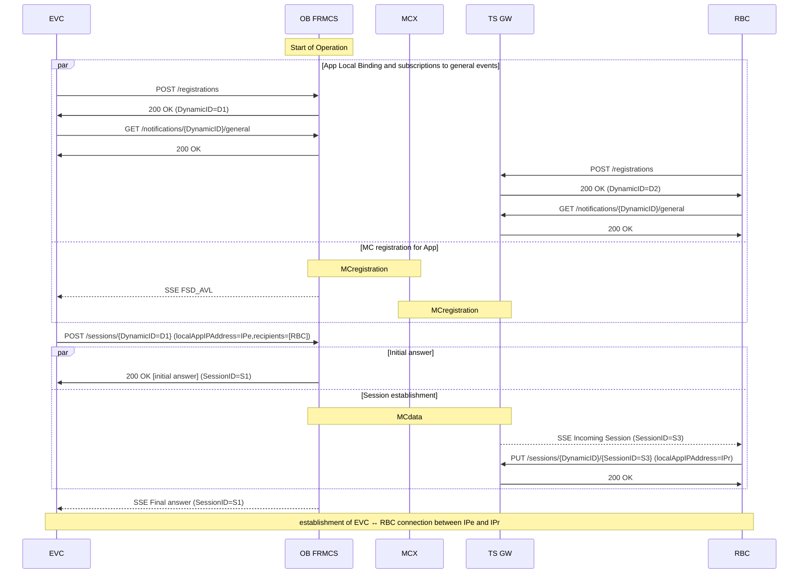
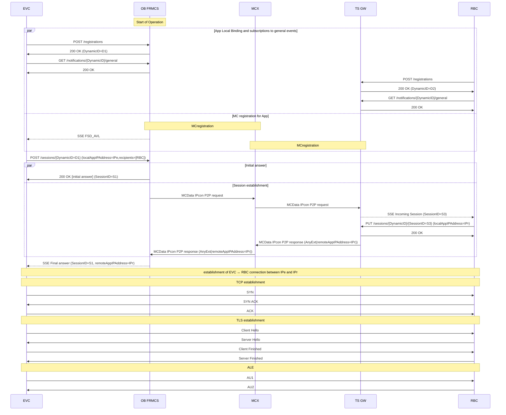
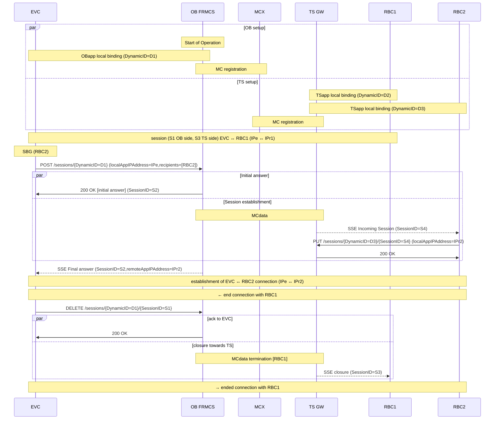
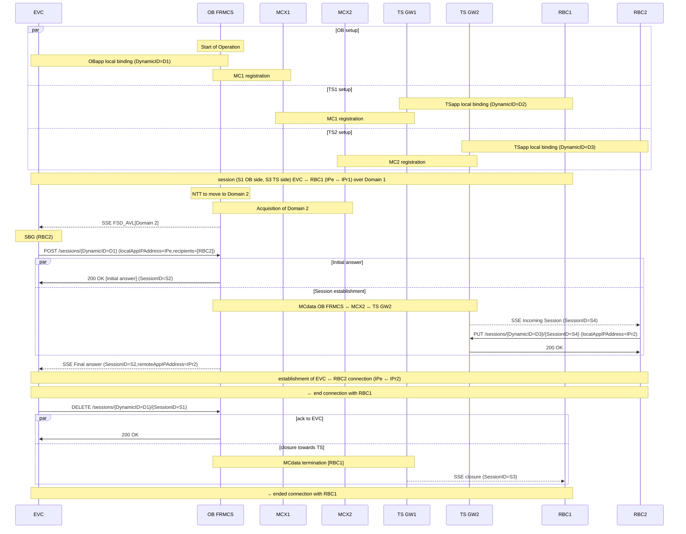
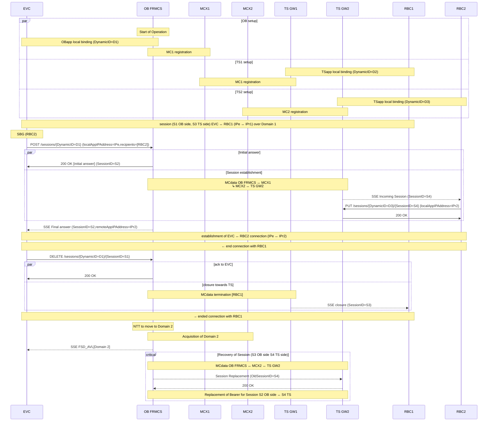

# Introduction

The present page provides an illustration of the OBapp / TSapp API in call flows in the context of ETCS.

# ETCS flow - connection to RBC

## High-level flow

## Details

# ETCS flow - inter-RBC (national)

## High-level flow

# ETCS flow - inter-RBC (cross border standard case) 

## High-level flow

# ETCS flow - inter-RBC (cross border RBC HO occurs before NTT) 

## High-level flow

