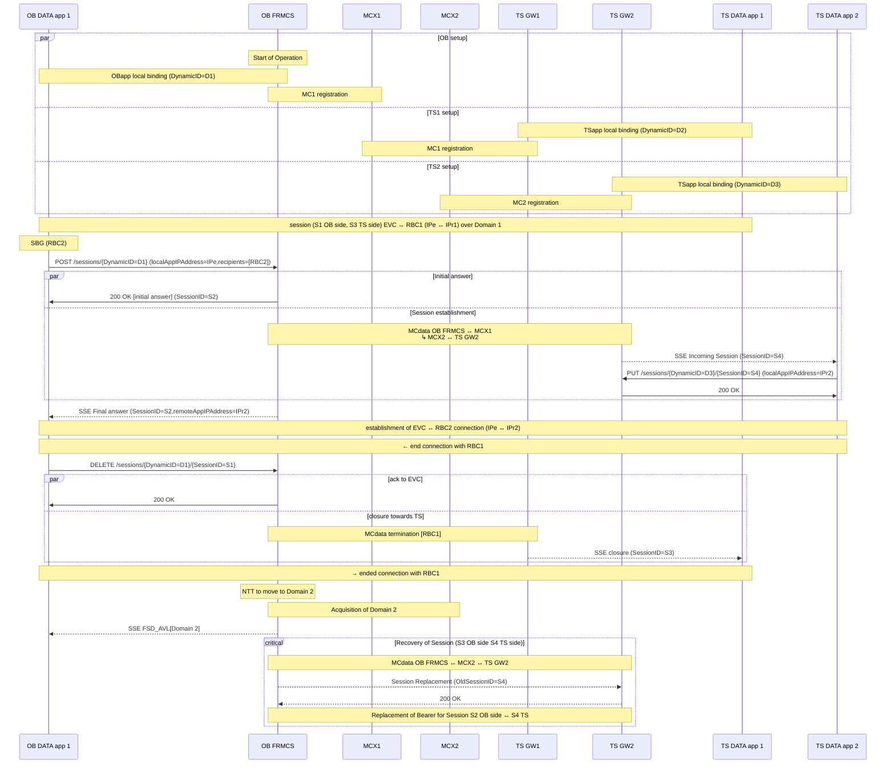

# Generic LC app flow - inter-RBC (cross border with make-before-brake constraint 1 RM 1 MCx client) 

## High-level flow

```mermaid

sequenceDiagram
participant A as OB DATA app 1
participant O as OB FRMCS
participant M1 as MCX1
participant M2 as MCX2
participant T1 as TS GW1
participant T2 as TS GW2
participant B1 as TS DATA app 1
participant B2 as TS DATA app 2

par OB setup
	Note over O: Start of Operation 
	Note over A,O: OBapp local binding (DynamicID=D1)
	Note over O,M1:	MC1 registration
and TS1 setup
	Note over B1,T1: TSapp local binding (DynamicID=D2)
	Note over T1,M1:	MC1 registration
and TS2 setup
	Note over B2,T2: TSapp local binding (DynamicID=D3)
	Note over T2,M2:	MC2 registration

end

% existing session with B1
Note over A,B1: session (S1 OB side, S3 TS side)  EVC ↔ RBC1 (IPe ↔ IPr1) over Domain 1
% establishment of session to B2
Note over A:	SBG (RBC2)

A->>O:	POST /sessions/{DynamicID=D1} (localAppIPAddress=IPe,recipients=[RBC2])
par Initial answer
	O->>A:	200 OK [initial answer] (SessionID=S2)
and Session establishment
	Note over O,T2:	MCdata OB FRMCS ↔ MCX1<br/>↳ MCX2 ↔ TS GW2
	T2-->>B2:	SSE Incoming Session (SessionID=S4)
	B2->>T2:	PUT /sessions/{DynamicID=D3}/{SessionID=S4} (localAppIPAddress=IPr2)
	T2->>B2:	200 OK
end
O-->>A:	SSE Final answer (SessionID=S2,remoteAppIPAddress=IPr2)	
Note over A,B2: establishment of EVC ↔ RBC2 connection (IPe ↔ IPr2)
Note over A,B2: ← end connection with RBC1
A->>O:	DELETE /sessions/{DynamicID=D1}/{SessionID=S1}
par ack to EVC
	O->>A:	200 OK
and closure towards TS
	Note over O,T1:	MCdata termination [RBC1]
	T1-->>B1: SSE closure (SessionID=S3)
end
Note over A,B1: → ended connection with RBC1
% NTT to move to domain 2
Note over O: NTT to move to Domain 2
% Domain Change
Note over O,M2: Acquisition of Domain 2
% SSE FSD_AVL
O-->>A: SSE FSD_AVL[Domain 2]
critical Recovery of Session (S3 OB side S4 TS side)
	Note over O,T2:	MCdata OB FRMCS ↔ MCX2 ↔ TS GW2
	O-->>T2:	Session Replacement (OldSessionID=S4)
	T2-->>O:	200 OK
	Note over O,T2: Replacement of Bearer for Session S2 OB side ↔ S4 TS
end
```
