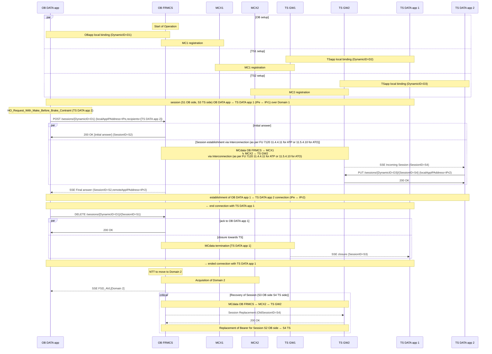
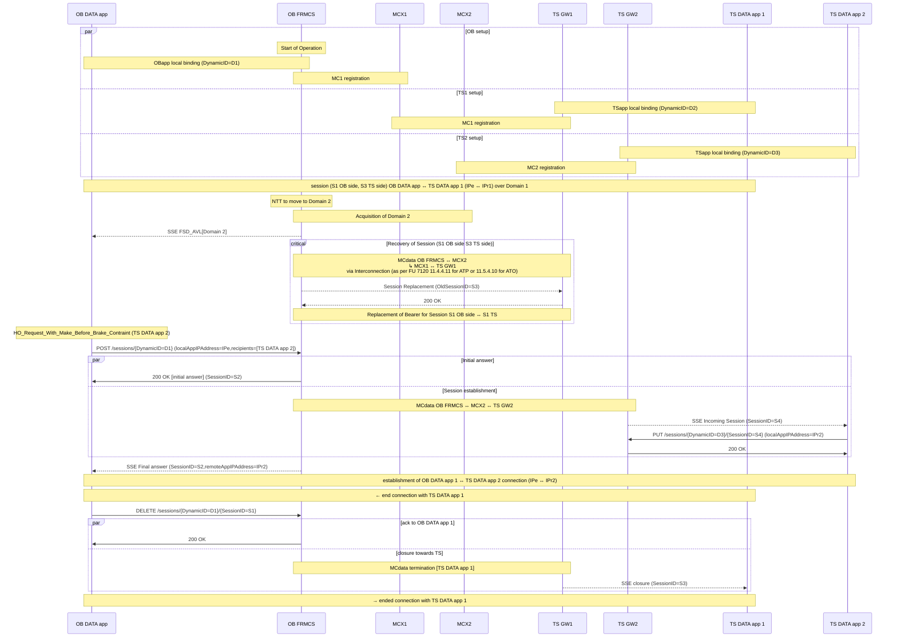
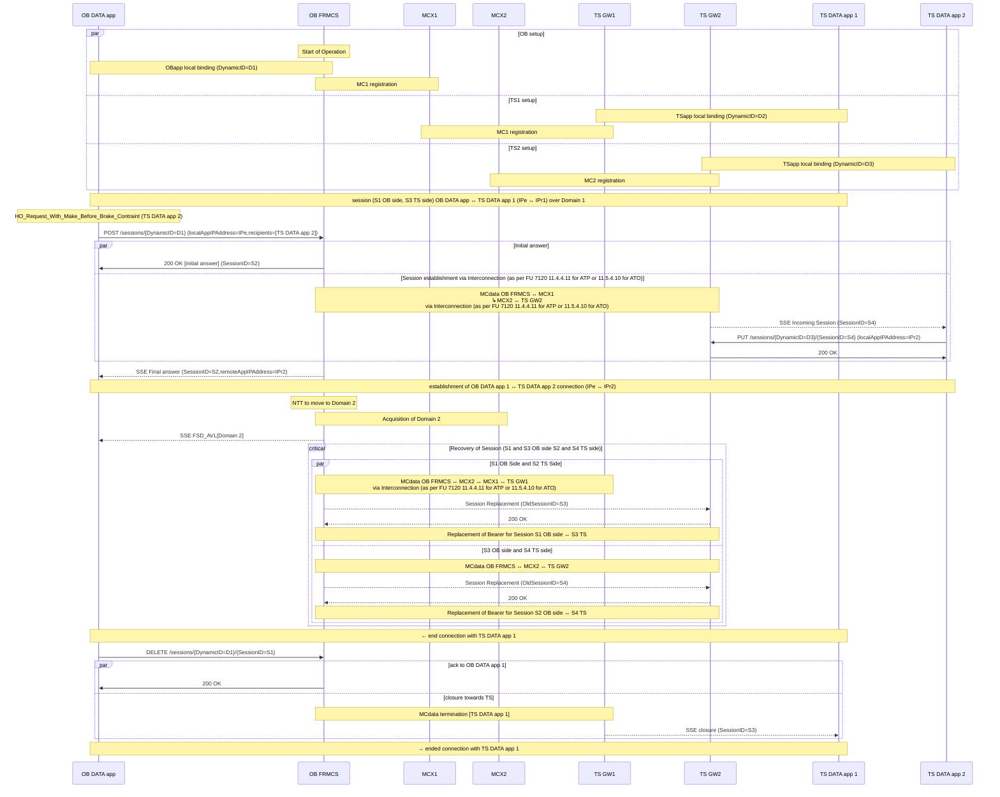

# Generic LC app flow - inter-RBC (cross border with make-before-break constraint 1 RM 1 MCx client) 
# Network Transition occuring after Hand Over

## High-level flow
## Session recoveries might be handled at GW level (but not only option if something exists)

# Generic LC app flow - inter-RBC (cross border with make-before-break constraint 1 RM 1 MCx client) 
# Network Transition occuring before Hand Over

## High-level flow
## Session recoveries might be handled at GW level (but not only option if something exists)

# Generic LC app flow - inter-RBC (cross border with make-before-break constraint 1 RM 1 MCx client) 
# Network Transition occuring during Hand Over

## High-level flow
## Session recoveries might be handled at GW level (but not only option if something exists)

